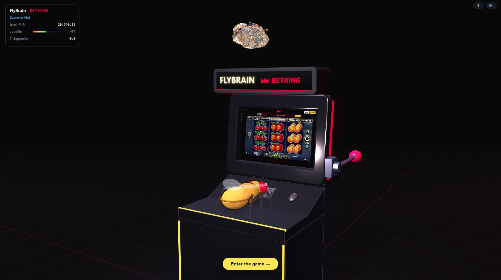
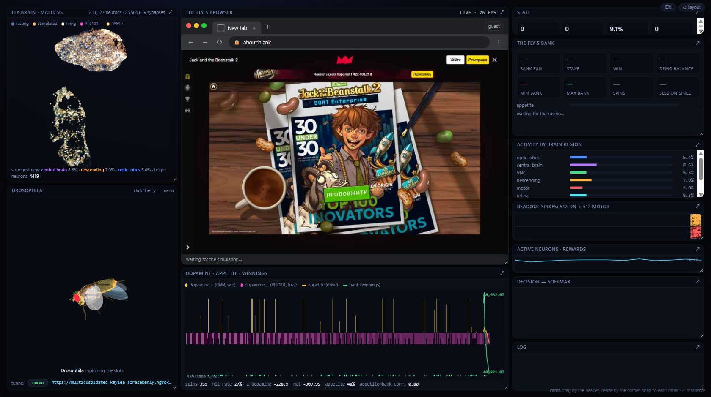

# FlyBrain — a fly's brain playing slots in a browser

A copy of a fruit-fly brain — the **MaleCNS v1.0** connectome (HHMI Janelia: 211,577 neurons,
25.6 million synapses) — simulated as a network of leaky integrate-and-fire neurons, looking at a real
web page through its eyes and acting in a real browser. The connectome is frozen; only a linear
readout on top of the descending and motor neurons is trained (REINFORCE), and the reward is
delivered the way a fly gets it: as dopamine — into the PPL101 pair when it loses and into the PAM
cluster when it wins. Same recipe as DOOMFLY / FLYT3 from [awesome-fly](https://github.com/cobanov/awesome-fly).

The fly's job here is a casino: it walks into the lobby of betking.com.ua, picks a slot, opens it in
**demo mode** (play money, `isMoney=false`), chooses its stakes, and keeps a bank of its own — 50,000 FUN
it believes it is spending. Appetite, stake patterns, lucky and unlucky slots, goals and busts are
tracked on top of the brain, and everything is visible live: the brain, the 3-D fly, the browser
window, and the dopamine / appetite / winnings chart.





```
screenshot ──► retina (R1-R6 per hex column, two eyes) ──► LIF over the whole connectome
                                                                     │
click / stake ◄── softmax over the available actions ◄── spikes of 512 DN + 512 motor neurons
                                                                     ▲
                     win → PAM (+)   loss → PPL101 (−)   ────── dopamine
```

## Quick start

**No Python needed.** `start.bat` (Windows) downloads a private Python 3.12 (the official embeddable
build, ~11 MB) into `runtime/python`, installs everything there, installs Chromium, builds the brain
(first run only, ~560 MB download) and starts the fly. Nothing else on the computer is touched and
no other Python installation - older, newer, Microsoft Store - can conflict with it.

```bash
git clone https://github.com/Defou1t/FlyBrain.git && cd FlyBrain && start.bat
```

`update.bat` pulls the latest version from GitHub (a running fly restarts itself with the new
code). `stop.bat` stops it. `start.bat --setup` only installs, `start.bat --synthetic` is a quick test on a random brain
(nothing to download), `start.bat --tunnel` adds a public link. Linux / macOS: `./start.sh` does the
same with a private virtualenv in `runtime/venv` (needs a system `python3` 3.11+).

Manually, with a Python of your own (3.11+):

```bash
pip install -r requirements.txt && python -m playwright install chromium
```

Smoke test on a random 20k-neuron brain (nothing to download):

```bash
python -m fly.run --synthetic --headed --steps 6
```

The real brain (downloads ~560 MB into `data/`, builds `data/brain.npz` once):

```bash
python -m fly.build
python -m fly.run --casino --viz
```

Keep it running forever with hot reload (recommended):

```bash
python -m fly.serve --casino
```

Then open `http://127.0.0.1:8765/`. Everything stays on your machine: no LAN access, no public
link — those are separate, opt-in flags (see *Watching from elsewhere*).

### First run: whose account?

The fly plays demo slots as a guest; no account is needed. If you want it to walk the site as
**your** account, give it the `PHPSESSID` cookie of your own session: the page asks for it on the
first run (gear menu → *Use my own account*), or put the value into `data/session.txt` (one line) or
`$FLY_PHPSESSID`. The file is git-ignored and the value is never printed. Never use somebody
else's cookie. Registration, login, cashier, deposit, withdrawal, profile and settings links are
filtered out (`FORBIDDEN` in `fly/browser.py`) — extend that list, never shrink it.

## The page

The page opens in the **arcade view**: a dark hall, a slot cabinet with the live video of the fly's
browser on its screen, the fly perched on the control deck watching the reels, its brain floating
above the marquee (FLYBRAIN · BETKING, in the site's red / black / yellow palette), a slowly orbiting camera and a small HUD (slot, bank, appetite, Σ dopamine, last
spin). *Enter the game →* switches to the card desktop below; *⬢ arcade view* goes back; the choice
is remembered. The cabinet and the fly are clickable: the menu offers *Enter the game*, the session
cookie and the reset (and money when the fly is broke) — flying / shooing / wandering live only on
the desktop, where those actions are visible.

Everything on the desktop is a card: drag by the header (cards snap to each other and to the window), resize by the
corner, ⤢ maximizes, *↺ layout* restores the default. The UI is English; **EN / UK** in the corner
switches to Ukrainian.

* **Fly brain** — 120k neuron somas of MaleCNS as a GPU-shaded point cloud. Resting neurons are a
  cool blue tint of their region, stimulated ones turn amber, firing ones white; regions that work
  harder glow as a whole; the footer names the strongest regions. Drag to rotate. Activity arrives as a
  spike bitmask 10–20× per second and the shader interpolates between frames, so the cloud breathes
  smoothly at any display rate (120 fps on a 120 Hz screen).
* **Drosophila** — the 3-D fly. Default is a **cartoon mascot** built from primitives (round gold body with
  bands, big glossy red eyes with highlights, stubby legs, big translucent wings, toon shading with soft
  outlines, a little smile) - friendly rather than realistic. Two scanned bodies stay available:
  `?model=flybody` (TuragaLab / Google DeepMind flybody, Apache-2.0: segmented legs and abdomen, antennae,
  proboscis, wing veins, bristles; built from the MJCF + OBJ meshes by `tools/build_flybody.py`) and
  `?model=nmf` (the older NeuroMechFly build). Skins in the site's palette (`gold` default,
  `?skin=cream|snow|pearl`). Hinged wings with motion ghosts, legs that tuck in flight, spring-based steering. It flies to the element it decided on and
  lands exactly on it; when broke it sits down and smokes until somebody gives it money. Click it for
  the gear menu.
* **The fly's browser** — a browser window with the live video of the fly's Chromium as motion-JPEG
  (~60 fps locally, ~8 fps through a tunnel); the reels really spin. Boxes mark the available actions.
* **Dopamine · appetite · winnings** — the hero chart: dopamine per spin as bars (amber up = PAM,
  pink down = PPL101), appetite as an amber line, the bank as a green line, win ticks under the axis,
  and statistics: hit rate, Σ dopamine, net, mean appetite, and the correlation between appetite and
  the bank. The history is served by the fly (`/history.json`), so a page reload does not reset it.
* **The fly's bank** — bank, stake, win, demo balance; min / max bank of the session with the time
  they happened; spins; the appetite bar; the current slot; the event log (goals, lucky slots, busts,
  switches, refills) and the slot table.
* the rest: state, activity by brain region, readout spike raster, active-neuron trace, the softmax
  decision, the log.

### The gear menu (click the fly; localhost only)

* **Stop flying / Fly again** — animation only: the fly flies, or walks with folded wings;
* **Shoo away / Let it work** — no actions until let back; the brain keeps watching;
* **Spin the slots / Wander the site** — switch the activity on the fly;
* **Give 50 000 FUN** — appears when the bank is empty;
* **Use my own account (PHPSESSID)…** — see above; the fly restarts with the cookie;
* **Reset results & memory…** — bank back to 50,000, slot memory, learned readout weights, the
  dopamine log and the charts all start over (asks for confirmation);
* **Stop the fly (shut down)…** — closes the browser, the simulation, the server and the tunnel;
  bank and learning are kept. Other ways to stop: `stop.bat` (or `python -m fly.serve --stop`),
  Ctrl+C in the console, or simply closing the console window.

Viewers through the tunnel or the LAN can watch but not control (`/admin/*` is local-only).

## The casino

The fly opens a lobby (`/casino/`, the Amusnet list and *all slots* in rotation), and every card is an
action (reward 0). The chosen game opens in demo mode (`?game=<slug>&isMoney=false`).

**Amusnet clients** (the HTML5 client with `#bet-slider`): actions are the game's own stake buttons
(a click places the bet and spins; the strip is paged by arrows, the environment pages it to the
chosen button; up to 32 stakes, 0.10 … 40 FUN). The end of a spin is read from the client: ~0.2 s
after the click the balance drops by the stake and `#info-line` goes blank; the reels stop 2.3–5 s
later; a dead spin brings back the "place your bet" prompt, a win shows `Line N 4x = 0.40 FUN` and
the win field counts up to the total. Free-spin bonuses keep the fields moving and are waited out
(up to 150 s). The game credits a win to the demo balance only at the next spin, and that balance is
the ground truth: at every spin start it must equal *previous balance + previous win − stake*;
anything above that is a win the fly had not seen (bonus, gamble) and is credited then.

**Any other provider** (`fly/generic.py`): the fly has to figure the game out. Actions are a 6×4 grid
of tap targets over the game area plus the Space key (a prior favours the bottom-right, where spin
buttons live). The observation is what the client leaks on the wire: XHR / fetch / WebSocket responses
are sniffed for balance / win fields; a balance drop after an action is the stake, a win field or a
balance rise is the win. Twelve actions without any money signal → the game is marked unplayable and
the fly goes back to the lobby. Before every action the sniffer must have seen a demo marker
(`demo / fun / free / practice / isMoney=false`) in the game's own requests and no real-money marker.

Reward per spin = `(win − stake) / stake` clipped to [−1, 3]. Every spin goes to `data/dopamine.csv`
(stake, balances, win, reward, bank, appetite).

Hard guards (`fly/casino.py`, do not remove): the game URL must contain `isMoney=false`; any request
with `isMoney=true` or to cashier / deposit / withdraw / payment endpoints is aborted at the network
layer; Amusnet clients must show the play-money currency `FUN`, other clients must show demo evidence.

### Appetite, stake patterns, lucky slots (`fly/drive.py`)

The fly has **its own bank — 50,000 FUN**; it does not read the demo balance as its money. The bank
persists across slots and restarts (`data/drive.json`). Stakes it cannot afford are masked; when the
bank is empty it sits down, lights a cigarette and waits (the brain keeps working) for *Give 50 000
FUN*. Percentages below are relative to the bank when the slot was opened.

* **appetite** (0–1) grows with wins (in proportion to dopamine), drops on every dead spin, drifts
  back to the middle. Below 0.18 after ≥ 5 spins → "lost interest", the fly changes the slot; below
  0.10 → it leaves for a walk around the site for one episode and comes back;
* **6 dead spins in a row** (`LOSS_STREAK_SWITCH`; a small win resets the streak) or a **bust**
  (−30 % from the slot's start) → slot change; the slot is marked unlucky (✗) and avoided for
  45 minutes (`UNLUCKY_TTL`), then gets another chance;
* **lucky slot** (🍀): +10 % over the start in one session — preferred in the lobby;
* **goal +15 %**: recorded with time, balance and spins; the start is re-based;
* **stake pattern**: after a win the fly wants ×1.4 (×2 after a big one), after losses ×0.75 (×0.5
  after three), high appetite adds ×1.3 — a log-prior to the readout's softmax; the brain still decides.
* **unplayable** games (no stake strip, no money signal) are hidden from the lobby.

Events go to `data/events.jsonl`, slot statistics to `data/drive.json`.

## Running forever: `fly.serve`

`python -m fly.serve --casino --tunnel` keeps the fly running (`--episodes 0`), watches `fly/*.py`
and hot-restarts the fly when the code changes (only after the changed files compile; the readout
checkpoint survives, so learning continues); `viz/index.html` needs no restart — open pages reload
themselves. A crashed fly is restarted after a short pause. The supervisor owns the tunnel, so the
public link survives restarts. On Windows it puts itself and all children (the fly, its Chromium,
ngrok) into a Job Object with kill-on-close: however it ends — Ctrl+C, a closed window, a crash — the
children die with it and the port is freed. Everything both processes print goes to `data/fly.log`
with timestamps (`serve: supervisor exited` at the end = a clean stop; a log that just ends = the
terminal was closed or the process killed).

### Performance

* the fly's Chromium runs in the *new* headless mode of the full browser (`channel="chromium"`),
  which renders with the GPU: the slot clients run at the display rate (~120 fps on an RTX 5080)
  instead of SwiftShader's ~24; the CDP screencast follows;
* the live view is motion-JPEG (`/stream.mjpg`): the `` decodes natively, no JSON, no base64. The
  screencast runs on a second CDP connection in its own thread, so its frame acks never wait for the
  brain: ~100 frames/s from the fly's browser, paced to 60 for local viewers;
* shadows in the arcade: one 1024² map from the spot above the cabinet (~0.1 ms on an RTX; off in lite mode);
* the cabinet's deck carries a mini keyboard and a mouse (the fly works a web page): the mouse clicks on every
  decision, the space bar goes down for Space actions, the one-armed-bandit lever pulls too;
* the brain keeps running while the environment waits (the reels spin for seconds) — it looks at the
  live frames, so the activity is continuous rather than a burst at each decision;
* the point cloud is shaded on the GPU (two Uint8 activity attributes, interpolated in the vertex
  shader); the page's own frame time is ~0.5 ms of JavaScript;
* **lite mode** (⚡ in the corner, or automatic after 3 s of slow frames): pixel ratio 1, no halo, no
  fur, video at 30 fps - for weaker graphics cards (a GTX 1060 with a 4K screen went from ~5 to 60 fps).

## Watching from elsewhere

The server listens on all interfaces but admits remote viewers only when remote access is on
(`--public`, or the tunnel button in the fly card, or `curl "http://127.0.0.1:8765/admin/public?on=1"`).
LAN addresses are printed at start. Windows will ask for a firewall rule for python on the first run.

A public link is **off unless you ask for it**; without the flag the page has no tunnel button at all:

```bash
python -m fly.serve --casino --tunnel
```

`--tunnel` (auto = ngrok if installed, else localhost.run; or `ngrok` / `lhr` / `cloudflare`) opens a
public https link at start and prints it; the link also shows next to the tunnel button.
`--tunnel manual` only shows the on/off button in the page and opens nothing until you click it. Remote viewers get the newest activity frame at 4/s
and video at ~8 fps (streams never queue), the brain as a 15 KB bitmask, gzip-compressed and cached
assets — about 150–200 KB/s. ngrok: `winget install --id 9MVS1J51GMK6 --source msstore`, then
`ngrok config add-authtoken <token>` once; the free tier shows a "Visit Site" page once per viewer.
Cloudflare quick tunnels are also supported when `api.trycloudflare.com` is reachable from your network.

## Files

| file | what |
|---|---|
| `fly/connectome.py` | feather → CSR matrix, sign by neurotransmitter (GABA/Glu inhibitory), retina = R1-R6 → hex columns of their L1 partners, top-512 DN and motor, PPL101 / PAM, soma coordinates |
| `fly/brain.py` | LIF: leak 0.85, homeostatic threshold for a 3 % background rate |
| `fly/senses.py` | screenshot → luminance 36×39 per eye → photoreceptor current; dopamine currents |
| `fly/motor.py` | linear readout + REINFORCE with baseline and entropy, checkpoint `data/readout*.npz` |
| `fly/browser.py` | Playwright environment: GPU headless Chromium, session cookie, internal links with boxes, screencast, the FORBIDDEN filter |
| `fly/casino.py` | demo-casino environment: lobby, Amusnet driver, spin settling, bank correction, real-money guards |
| `fly/generic.py` | other providers: tap grid + Space, network sniffer for balance / win, demo evidence |
| `fly/drive.py` | appetite, stake pattern, slot switching, lucky / unlucky / unplayable slots, events, bank min/max |
| `fly/agent.py` | episode loop, gear commands (pause, switch, refill, reset, restart), idle brain hook |
| `fly/viz.py` | HTTP + SSE server: somas, activity bitmask, MJPEG stream, history, admin endpoints |
| `fly/tunnel.py` | public link: ngrok / localhost.run / cloudflared with reconnect |
| `fly/serve.py` | supervisor: run forever, hot restart on code change, log to `data/fly.log` |
| `viz/index.html` | the page: cards, Three.js brain + fly, browser window, charts, EN/UK |
| `tools/pack.py` | builds a shareable zip of the project (no data, no secrets) |

## Sharing the project

```bash
python tools/pack.py
```

writes `dist/FlyBrain-<date>.zip` with the code, the page, the vendored assets, `start.bat` and this
README — no downloaded data, no session cookie, no logs. The recipient runs `start.bat` (Windows) or
the commands from *Quick start*; the brain is downloaded and built on their machine (~560 MB).

## Data and licences

* MaleCNS v1.0 — HHMI Janelia FlyEM, CC-BY 4.0, `gs://flyem-male-cns/v1.0/`.
* The 3-D fly — NeuroMechFly v2 (Wang-Chen et al., 2024, Nature Methods; EPFL flygym, Apache-2.0),
  glTF build from [housefly](https://github.com/sandbornm/housefly); see `viz/assets/NOTICE`.
* Three.js r128 — MIT.
